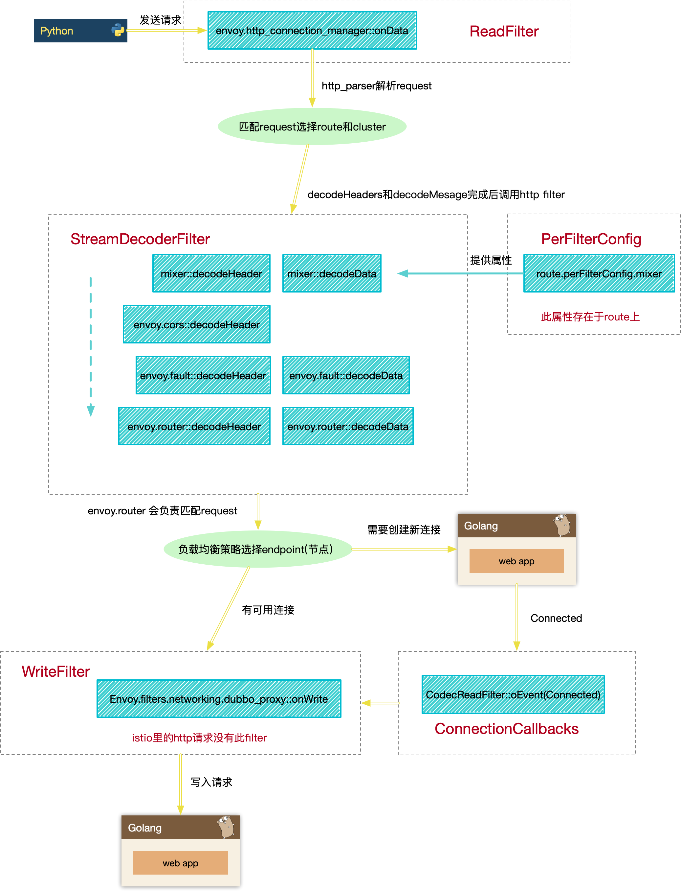

#  简介 

Envoy是istio的核心组件之一，以sidecar的方式与服务运行在一起，对服务的流量进行拦截转发。 具有路由，流量控制等等强大特性。

filter是envoy的核心功能之一，采用插件的形式提供功能，请求各个阶段都有filter的hook，用户可以自由添加自定义类型的filter添加新的功能

本文以istio1.1所对应的Envoy版本进行源码流程分析

# 名词解释

- 下游: 发送请求给Envoy的服务，client
- 上游：接收Envoy发送的请求，并返回响应的服务， server


# Filter流程图

下面的流程图为istio架构下，访问80端口的http服务的流程

## 

1. Client向Envoy的15001 port建立连接，被转到80 port的Listener

   

2. Client发送请求给Envoy，Envoy经过路由后找到上游Server，并发送请求

   

3. 上游Server返回响应给Envoy，Envoy利用event_active立即返回响应给下游的client

   

4. Client主动断开下游到Envoy的连接

   

5. Server主动断开Envoy到上游的连接

   

# Filter分类

1. **ListenerFilter**

    [listener.listener_filters](<https://www.envoyproxy.io/docs/envoy/latest/api-v2/api/v2/listener/listener.proto#listener-listenerfilter>)

    用于接收到下游新连接的时候回调

    接口：

    - `onAccept(callback)` 

    内置类型：

    - `envoy.listener.original_dst` （istio中的15001端口常用）

      根据iptables转换之前的dst port，查找到真实的Listener，查找到Listener会根据新的Listener的配置继续处理

    - `envoy.listener.tls_inspector` 

      注册read callback，识别tls和进行tls握手，握手结束后会进行下一步的filterChain的处

    注册filter：

    ```
    REGISTER_FACTORY(OriginalDstConfigFactory,
    				 Server::Configuration::NamedListenerFilterConfigFactory);
    ```

2. **ReadFilter**

    [listener.filter_chains.filters](<https://www.envoyproxy.io/docs/envoy/latest/api-v2/api/v2/listener/listener.proto#listener-filter>)

    1. 用于接受到下游新连接的时候回调
    2. 上游或者下游连接上有数据可以读取的时候的回调，一般用于协议的解析

    接口：

    - `onNewConnection()`

    - `onData(data, end_stream)`

      ...

    内置类型：

    - `Envoy::Http::CodecClient`  只在向上游的连接用到，且向上游的连接只有这个filter，用于读取响应

    - `envoy.http_connection_manager`

       处理http请求的主要filter

    - `envoy.tcp_proxy`

    - `envoy.redis_proxy`

      ...

    注册filter：

    ```
    REGISTER_FACTORY(HttpConnectionManagerFilterConfigFactory,
    			     Server::Configuration::NamedNetworkFilterConfigFactory)
    ```

3. **WriteFilter**

    [listener.filter_chains.filters](<https://www.envoyproxy.io/docs/envoy/latest/api-v2/api/v2/listener/listener.proto#listener-filter>)

    用于向上游的连接写入数据的时候回调（目前内置的writeFilter没有http相关的）

    接口：

    - `onWrite(data, end_stream)`

    内置类型：

    - `envoy.filters.network.dubbo_proxy`
    - `envoy.mongo_proxy`
    - `envoy.filters.network.mysql_proxy`
    - `envoy.filters.network.zookeeper_proxy`

​       注册filter：

```
REGISTER_FACTORY(HttpConnectionManagerFilterConfigFactory,
                    Server::Configuration::NamedNetworkFilterConfigFactory)   
```

4. **StreamDecodeFilter**  ( `envoy.http_connection_manager`下独有的filter) 

   [listener.filter_chains.filters[envoy.http_connection_manager].http_filters](<https://www.envoyproxy.io/docs/envoy/latest/api-v2/config/filter/network/http_connection_manager/v2/http_connection_manager.proto#envoy-api-msg-config-filter-network-http-connection-manager-v2-httpfilter>)

   用于解析http请求各个部分的时候回调执行

   接口：

   - `decodeHeaders(headers, end_stream)`

   - `decodeData(data, end_stream)`

   - `decodeTrailers(HeaderMaps& trailers)`

   - `decodeComplete()`

     ...

   内置类型：

   - `envoy.cors`

   - `envoy.fault`

   - `envoy.router`

     ...

   注册filter：

   ```
   Http::FilterFactoryCb
   DynamoFilterConfig::createFilter(const std::string& stat_prefix,
                                    Server::Configuration::FactoryContext& context) {
     return [&context, stat_prefix](Http::FilterChainFactoryCallbacks& callbacks) -> void {
       callbacks.addStreamFilter(Http::StreamFilterSharedPtr{new Dynamo::DynamoFilter(
           context.runtime(), stat_prefix, context.scope(), context.dispatcher().timeSource())});
     };
   }
   
   REGISTER_FACTORY(DynamoFilterConfig, Server::Configuration::NamedHttpFilterConfigFactory);    
   ```

   

5. **StreamEncodeFilter** (`envoy.http_connection_manager` 下独有的filter) 

   [listener.filter_chains.filters[envoy.http_connection_manager].http_filters](<https://www.envoyproxy.io/docs/envoy/latest/api-v2/config/filter/network/http_connection_manager/v2/http_connection_manager.proto#envoy-api-msg-config-filter-network-http-connection-manager-v2-httpfilter>)

   发送响应各个部分给下游client的时候执行

   接口：

   - `encode100ContinueHeaders(headers)`

   - `encodeHeaders(headers, end_stream)`

   - `encodeData(data, end_stream)`

   - `encodeTrailers(HeaderMap& trailers)`

   - `encodeMetadata(metadata_map)`

   - `encodeComplete()`

     ...

   内置类型：

   - `envoy.cors`

   - `envoy.fault`

   - `envoy.lua`

     ...

   注册filter：

   ```
   Http::FilterFactoryCb
   DynamoFilterConfig::createFilter(const std::string& stat_prefix,
                                    Server::Configuration::FactoryContext& context) {
     return [&context, stat_prefix](Http::FilterChainFactoryCallbacks& callbacks) -> void {
       callbacks.addStreamFilter(Http::StreamFilterSharedPtr{new Dynamo::DynamoFilter(
           context.runtime(), stat_prefix, context.scope(), context.dispatcher().timeSource())});
     };
   }
   
   REGISTER_FACTORY(DynamoFilterConfig, Server::Configuration::NamedHttpFilterConfigFactory);            
   ```

   

6. **PerFilterConfig** (并不是filter，只是为4，5中的http_filter提供route级别的配置数据)

    [route.virtual_hosts.per_filter_config](<https://www.envoyproxy.io/docs/envoy/latest/api-v2/api/v2/route/route.proto#route-virtualhost>)

    位于route上的字段，只有当对应Listener上http_connection_manager包含对应httpfilter的时候才有用，结构为 `map<string, Struct>` 用法由filter自己实现

7. **ConnectionCallbacks**

    [listener.filter_chains.filters](<https://www.envoyproxy.io/docs/envoy/latest/api-v2/api/v2/listener/listener.proto#listener-filter>)

    接口：

    - `onEvent(event)` 

      事件分为 `RemoteClose`, `LocalClose`, `Connected`  会在各个阶段调用

    - `onAboveWriteBufferHighWatermark()`

    - `onBelowWriteBufferLowWatermark()`

    类型：

    - `Envoy::Http::CodeClient` 只在向上游的连接用到，且向上游的连接只有这个filter，用于检测上游连接断开
    - `envoy.http_connection_manager`
    - `envoy.tcp_proxy`
    - `envoy.redis_proxy`

    注册filter：

    ```
    REGISTER_FACTORY(HttpConnectionManagerFilterConfigFactory,
    			     Server::Configuration::NamedNetworkFilterConfigFactory)
    ```

8. **access_log_handlers**

    接口：

    - `log(request_headers, response_headers, response_trailers, stream_info)`

    类型：

    - `Envoy::Http::Mixer::Filter` 

      istio为Envoy添加的Filter，在AccessLogHandlers这边主要用于Report

    - `Envoy::Extensions::AccessLoggers::File::FileAccessLog`

    - `Envoy::Extensions::HttpGrpc::File::HttpGrpcAccessLog`

    - `Envoy::Extensions::HttpFilters::TapFilter::Filter`


# Filter流程中关键步骤解析

### 1. findActiveListenerByAddress

根据socket的localaddress和port选择合适的Listener处理

1. 利用syscall找到iptables转化之前的dst port （如果有`envoy.listener.original_dst`）

   ```c++
   os_syscalls.getsockopt(fd, SOL_IP, SO_ORIGINAL_DST, &orig_addr, &addr_len)
   ```

2. 先匹配address和port和socket都一致的Listener，如果没找到再找port一致，address==0.0.0.0的Listener

   ```c++
     auto listener_it = std::find_if(
         listeners_.begin(), listeners_.end(),
         [&address](const std::pair<Network::Address::InstanceConstSharedPtr, ActiveListenerPtr>& p) {
           return p.second->listener_ != nullptr && p.first->type() == Network::Address::Type::Ip &&
                  *(p.first) == address;
         });
   
     // If there is exact address match, return the corresponding listener.
     if (listener_it != listeners_.end()) {
       return listener_it->second.get();
     }
   
     // Otherwise, we need to look for the wild card match, i.e., 0.0.0.0:[address_port].
     listener_it = std::find_if(
         listeners_.begin(), listeners_.end(),
         [&address](const std::pair<Network::Address::InstanceConstSharedPtr, ActiveListenerPtr>& p) {
           return p.second->listener_ != nullptr && p.first->type() == Network::Address::Type::Ip &&
                  p.first->ip()->port() == address.ip()->port() && p.first->ip()->isAnyAddress();
         });
     return (listener_it != listeners_.end()) ? listener_it->second.get() : nullptr;
   ```

### 2. 匹配request选择route和cluster

1. 在构造`RouteMatcher`的时候会遍历`virtual_hosts` 下的domains，并根据通配符的位置和domain的长度分为4个 `map<domain_len, std::unordered_map<domain, virtualHost>, std::greater<int64_t>>`

   - `default_virtual_host_` domain就是一个通配符(只允许存在一个)

   - `wildcard_virtual_host_suffixes_` domain中通配符在开头

   - `wildcard_virtual_host_prefixes_` domain中通配符在结尾

   - `virtual_hosts_` 不包含通配符

     

     ```c++
      for (const auto& virtual_host_config : route_config.virtual_hosts()) {
         VirtualHostSharedPtr virtual_host(new VirtualHostImpl(virtual_host_config, global_route_config,
                                                               factory_context, validate_clusters));
         for (const std::string& domain_name : virtual_host_config.domains()) {
           const std::string domain = Http::LowerCaseString(domain_name).get();
           bool duplicate_found = false;
           if ("*" == domain) {
             if (default_virtual_host_) {
               throw EnvoyException(fmt::format("Only a single wildcard domain is permitted"));
             }
             default_virtual_host_ = virtual_host;
           } else if (!domain.empty() && '*' == domain[0]) {
             duplicate_found = !wildcard_virtual_host_suffixes_[domain.size() - 1]
                                    .emplace(domain.substr(1), virtual_host)
                                    .second;
           } else if (!domain.empty() && '*' == domain[domain.size() - 1]) {
             duplicate_found = !wildcard_virtual_host_prefixes_[domain.size() - 1]
                                    .emplace(domain.substr(0, domain.size() - 1), virtual_host)
                                    .second;
           } else {
             duplicate_found = !virtual_hosts_.emplace(domain, virtual_host).second;
           }
           if (duplicate_found) {
             throw EnvoyException(fmt::format(
                 "Only unique values for domains are permitted. Duplicate entry of domain {}", domain));
           }
         }
     ```

     

2. 按照 `virtual_hosts_` => `wildcard_virtual_host_suffixes_` => `wildcard_virtual_host_prefixes_` => `default_virtual_host_` 的顺序查找

   同时按照map的迭代顺序（domain len降序）查找最先除去通配符后能匹配到的virtualhost，如果没有直接返回 404

   ```c++
   
   const std::string host = Http::LowerCaseString(headers.Host()->value().c_str()).get();
     const auto& iter = virtual_hosts_.find(host);
     if (iter != virtual_hosts_.end()) {
       return iter->second.get();
     }
     if (!wildcard_virtual_host_suffixes_.empty()) {
       const VirtualHostImpl* vhost = findWildcardVirtualHost(
           host, wildcard_virtual_host_suffixes_,
           [](const std::string& h, int l) -> std::string { return h.substr(h.size() - l); });
       if (vhost != nullptr) {
         return vhost;
       }
     }
     if (!wildcard_virtual_host_prefixes_.empty()) {
       const VirtualHostImpl* vhost = findWildcardVirtualHost(
           host, wildcard_virtual_host_prefixes_,
           [](const std::string& h, int l) -> std::string { return h.substr(0, l); });
       if (vhost != nullptr) {
         return vhost;
       }
     }
     return default_virtual_host_.get();
   
   ---
   
     const VirtualHostImpl* RouteMatcher::findWildcardVirtualHost(
       const std::string& host, const RouteMatcher::WildcardVirtualHosts& wildcard_virtual_hosts,
       RouteMatcher::SubstringFunction substring_function) const {
     // We do a longest wildcard match against the host that's passed in
     // (e.g. foo-bar.baz.com should match *-bar.baz.com before matching *.baz.com for suffix
     // wildcards). This is done by scanning the length => wildcards map looking for every wildcard
     // whose size is < length.
     for (const auto& iter : wildcard_virtual_hosts) {
       const uint32_t wildcard_length = iter.first;
       const auto& wildcard_map = iter.second;
       // >= because *.foo.com shouldn't match .foo.com.
       if (wildcard_length >= host.size()) {
         continue;
       }
       const auto& match = wildcard_map.find(substring_function(host, wildcard_length));
       if (match != wildcard_map.end()) {
         return match->second.get();
       }
     }
     return nullptr;
   }
   ```


3. 在一个virtualhost上查找对应route和cluster

   - 在通过domain匹配到virtualhost，会在那个virtualhost上匹配查找cluster，如果没匹配上，会直接返回404

   ```c++
    const VirtualHostImpl* virtual_host = findVirtualHost(headers);
     if (virtual_host) {
       return virtual_host->getRouteFromEntries(headers, random_value);
     } else {
       return nullptr;
     }
     
   ---
   route_ = callbacks_->route();
   if (!route_) {
       config_.stats_.no_route_.inc();
       ENVOY_STREAM_LOG(debug, "no cluster match for URL '{}'", *callbacks_,
       headers.Path()->value().c_str());
   
       callbacks_->streamInfo().setResponseFlag(StreamInfo::ResponseFlag::NoRouteFound);
       callbacks_->sendLocalReply(Http::Code::NotFound, "", nullptr, absl::nullopt);
       return Http::FilterHeadersStatus::StopIteration;
   ```

   - match可以根据配置分为 `prefix`, `regex`, `path` 三种route进行匹配

   - 如果存在`weighted_clusters` ，会根据`stream_id` , 和clusters的weight进行分发，`stream_id` 本身是每个请求独立随机生成，所以`weighted_clusters` 的权重分发可以视为随机分发

     

### 3. 负载均衡策略选择endpoint

  1. 在上一步查找到了clusterName, 对于clusterEntry，都是从`ThreadLocalClusterManagerImpl` 中取出，每个worker都一份自己的数据

  2. 对于`ThreadLocalClusterManagerImpl` , 维护了多份根据类型和协议区分的map 

     其中http协议才用的是`host_http_conn_pool_map_`  这个map，大致的结构为  `map<host, map<protocol, connpool>>` , 因为http分为 `Http10`, `Http11`, `Http2` 不同协议的connpool都是独立的

     对于http请求，会从 `host_http_conn_pool_map_` 中查到对应的connpool，每个worker都维护了一份自己独有的threadlocal connpool


# Mixer

mixerclient是istio基于Envoy，添加filter进行check和report的模块

### 注册到Envoy

```c++
Http::FilterFactoryCb createFilterFactory(const HttpClientConfig& config_pb,
                                            const std::string&,
                                            FactoryContext& context) {
    std::unique_ptr<Http::Mixer::Config> config_obj(
        new Http::Mixer::Config(config_pb));
    auto control_factory = std::make_shared<Http::Mixer::ControlFactory>(
        std::move(config_obj), context);
    return [control_factory](
               Http::FilterChainFactoryCallbacks& callbacks) -> void {
      std::shared_ptr<Http::Mixer::Filter> instance =
          std::make_shared<Http::Mixer::Filter>(control_factory->control());
      callbacks.addStreamFilter(Http::StreamFilterSharedPtr(instance));
      callbacks.addAccessLogHandler(AccessLog::InstanceSharedPtr(instance));
    };
```

注册到Envoy主要就是两行

```
callbacks.addStreamFilter(Http::StreamFilterSharedPtr(instance));
callbacks.addAccessLogHandler(AccessLog::InstanceSharedPtr(instance));
```

第一行注册了 `StreamDecodeFilter` 和 `StreamEncodeFilter`， `Http::Mixer::Filter` 在`decodeHeader` 这个hook中实现了Check，发送attributes给mixerserver进行检查

第二行注册了 `AccessLogHandler` ，这个会在 一个请求结束的时候执行

```
ConnectionManagerImpl::ActiveStream::~ActiveStream() {
  ...
  for (const auto& log_handler : access_log_handlers_) {
    log_handler->log(request_headers_.get(), response_headers_.get(), response_trailers_.get(),
                     stream_info_);
  }
 ...
}

```

在Mixer filter的log method中，会进行report操作

```
void ReportBatch::Report(
    const istio::mixerclient::SharedAttributesSharedPtr& attributes) {
  std::lock_guard<std::mutex> lock(mutex_);
  ++total_report_calls_;
  batch_compressor_->Add(*attributes->attributes());
  if (batch_compressor_->size() >= options_.max_batch_entries) {
    FlushWithLock();
  } else {
    if (batch_compressor_->size() == 1 && timer_create_) {
      if (!timer_) {
        timer_ = timer_create_([this]() { Flush(); });
      }
      timer_->Start(options_.max_batch_time_ms);
    }
  }
}
```

可以看到Mixer虽然是每个请求结束都会调用log，但实际的上报mixer是批量发送（累计一定大小或者到达一定时间间隔）

# 总结

1. 可以在Envoy处理请求的各个阶段加入filter来定制化功能，可以自己编写c++的filter，用`REGISTER_FACTORY` 注册到对应的Factory map中
2. istio通过mixer filter实现了check和report功能
